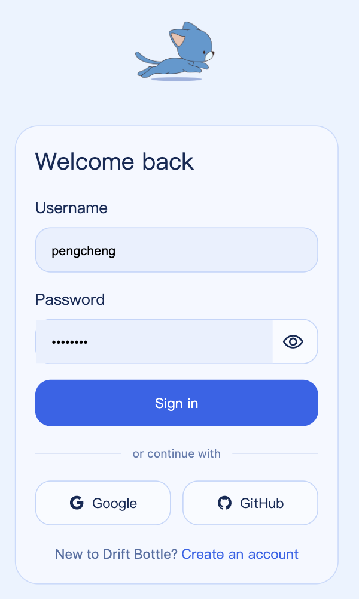
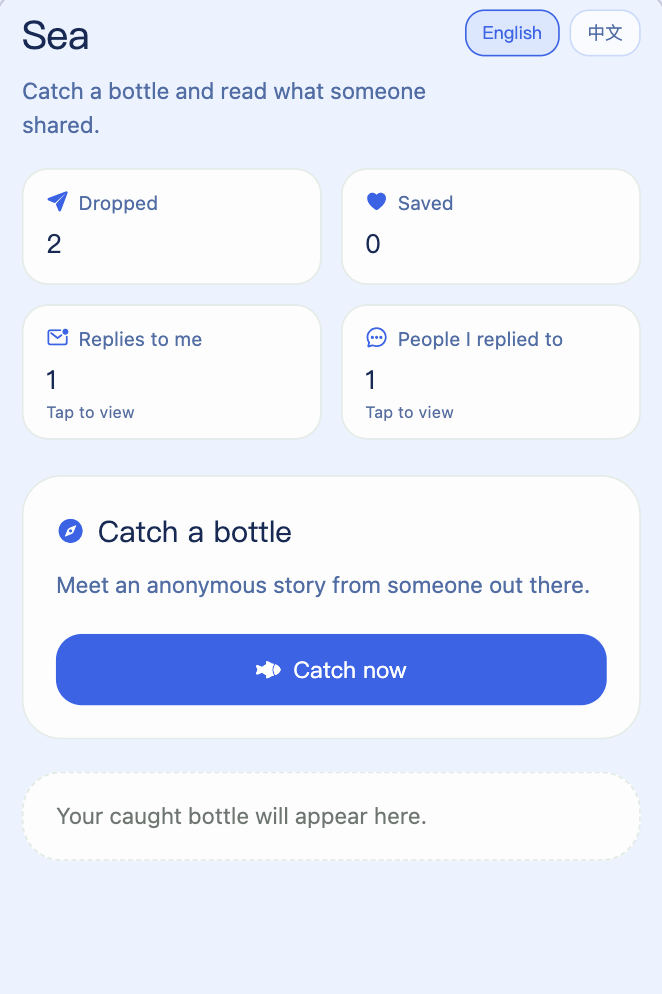
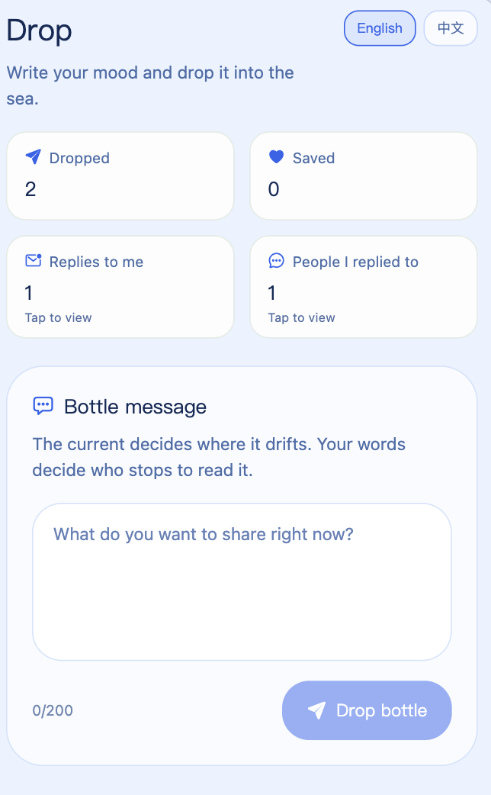

# 漂流瓶 Drift Bottle（Monorepo）

**中文**：一款以「漂流瓶」为隐喻的匿名心情分享应用：登录后可 **扔瓶**（写下当下心情）、在 **海洋** 里 **捞瓶**、回复与收藏；数据可与后端 API / Supabase 对齐。界面支持 **English / 中文** 切换（默认跟随系统，选择会持久化）。

**English**: An anonymous “message in a bottle”–style app: sign in, **drop** notes, **catch** others’ bottles in the **sea**, reply and save favorites; data can sync with the Nest API / Supabase. The UI supports **English / 中文** (system default with a persisted manual choice).

<p align="center">
  
  &nbsp;
  
  &nbsp;
  
</p>

<p align="center">
  <sub><b>登录</b> Sign-in</sub> · <sub><b>海洋</b> Sea</sub> · <sub><b>扔瓶</b> Drop</sub>
</p>

## 技术栈

| 层级 | 说明 |
|------|------|
| 仓库 | **pnpm** workspace 单体仓库 |
| 移动端 | **Expo ~54**、**React Native**、**expo-router**、**TypeScript**、**NativeWind**（Tailwind）、**Clerk** 鉴权、**i18next** + **expo-localization**、**ky** HTTP |
| 官网 | **Next.js**（App Router）、**Tailwind** |
| 后端 | **NestJS**、**TypeORM**、统一响应封装、Swagger |
| 数据 | **Supabase（PostgreSQL）** 迁移与 RLS；可选由 API 持 **service role** 写库 |
| 共享 | **`@drift-bottle/shared`**（workspace 包） |

本仓库为 **pnpm workspace** 单体仓库：移动端为 **Expo + React Native**，服务端为 **NestJS**，共享类型放在 **packages/shared**。

## 仓库结构

| 路径 | 说明 |
|------|------|
| `apps/mobile` | 漂流瓶 Expo 应用（expo-router、NativeWind、Clerk） |
| `apps/web` | 品牌官网（Next.js App Router + Tailwind v4，配色与文案与移动端对齐） |
| `apps/api` | NestJS HTTP API（默认端口 3000） |
| `packages/shared` | 前后端共享的 TypeScript 类型与常量（API 契约可逐步迁入） |
| `supabase/migrations` | **Supabase（PostgreSQL）** 表结构迁移，与移动端 `Bottle` 字段对齐 |

根目录 `package.json` 仅提供聚合脚本；各应用的依赖与脚本在各自目录的 `package.json` 中。

## 数据库（Supabase）

前端 `Bottle`（见 `apps/mobile/src/drift-bottle/types.ts`）字段与表对应关系如下：

| 前端字段 | 数据库 |
|----------|--------|
| `id` | `bottles.id`（uuid） |
| `content` | `bottles.content`（最长 200，与输入框一致） |
| `mood` | `bottles.mood`（枚举 `Calm` / `Confused` / `Anxious` / `Hopeful`） |
| `author`（`me` \| `stranger`） | 由 `bottles.author_id` 与当前登录用户 `id` 比较得出，不单独存列 |
| `replies`（`string[]`） | `bottle_replies` 多行，`content` + `author_id` + `created_at` |
| `createdAt` | `bottles.created_at`（`timestamptz`） |
| 收藏列表 | `bottle_favorites`（`user_id` + `bottle_id`） |

迁移文件：`supabase/migrations/20260401120000_init_drift_bottle.sql`。已为 `authenticated` 角色配置 **RLS**（读全部瓶子、只插入自己的瓶子；回复与收藏同理）。

**如何应用**

- 安装 [Supabase CLI](https://supabase.com/docs/guides/cli) 后，在项目根执行 `supabase link` 与 `supabase db push`；或  
- 在 Supabase 控制台 **SQL Editor** 中粘贴该迁移文件全文执行。

**与 Clerk 的关系**：当前移动端使用 Clerk 时，若客户端不共用 Supabase Auth JWT，则不宜把 `anon` key 直接暴露给 RN 写库；更稳妥做法是由 `apps/api` 使用 **service role** 密钥访问数据库，并在 Nest 里校验 Clerk 用户后再写入。迁移中的 RLS 适用于「Expo + Supabase Auth」或「后端持 service role」两种路径。

### 后端 TypeORM（`apps/api`）

- 实体：`apps/api/src/database/entities/`（`Bottle`、`BottleReply`、`BottleFavorite`），与上述表结构一致。  
- 在 **`apps/api/.env`** 配置 `DATABASE_URL`（可参考 `apps/api/.env.example`）。未配置时 `nest start` 会报错提示。  
- **`TYPEORM_SYNCHRONIZE`**：为 `true` 时由 TypeORM 根据实体自动同步表结构（适合**全新空库**）。你已在 Supabase 执行过 SQL 迁移时，请保持 **`false`**，避免与已有枚举、外键、RLS 冲突。  
- 连接 Supabase 池化地址时默认启用 TLS，且 `rejectUnauthorized` 默认为 `false`（与多数托管库一致）；本地无 SSL 的 Postgres 可设 `DATABASE_SSL=false`。`DATABASE_URL` 里可不写 `sslmode`，避免与 `pg` 新版本对证书链的默认行为打架。

## 环境要求

- Node.js（与 Expo 54 / Nest 11 兼容的版本）
- pnpm（推荐与 lockfile 一致的较新版本）

## 安装依赖

在**仓库根目录**执行：

```bash
pnpm install
```

> 若遇 pnpm 提示需允许依赖执行安装脚本（如 `@nestjs/core`），可在仓库根目录执行 `pnpm approve-builds` 按需放行。

## 运行官网（Web）

```bash
pnpm web
```

开发服务器默认 <http://localhost:5173>（与 `apps/api` 的 3000 端口错开）。生产构建：`pnpm web:build`；本地跑构建结果：`pnpm web:preview`（`next start`）。

## 运行移动端

```bash
pnpm mobile
```

等价于 `pnpm --filter mobile start`。也可使用：

- `pnpm mobile:android` / `pnpm mobile:ios` / `pnpm mobile:web`

首次请在 `apps/mobile` 下配置环境变量（见下文 Clerk）。

**Metro 报 `Unable to resolve module axios`**：根目录 `.npmrc` 使用 `node-linker=hoisted` 时，依赖会集中在仓库根 `node_modules`，`apps/mobile/node_modules` 里可能看不到 `axios`。`apps/mobile/metro.config.js` 已把根 `node_modules` 纳入解析并映射 `axios`；若仍报错，在仓库根执行 `pnpm install` 后，用 `pnpm mobile -- -c`（或 `expo start -c`）清缓存重启 Metro。

**接口 429 / 控制台疯狂打 `/bottles/*`**：多为 `useDriftBottleMvp` 里把 Clerk 的 `getToken` 放进 `useMemo` 依赖，引用每帧变化导致 `refreshAll` 与挂载时的 `useEffect` 形成死循环。实现上已通过 `useRef` 持有最新 `getToken`，并保持 `createDriftBottleApi` 只创建一次。

**接口 401，提示 `Provide Authorization: Bearer <Clerk JWT>`**：（1）在 **`apps/api/.env`** 配置与 Clerk 控制台一致的 **`CLERK_SECRET_KEY`**，且请求携带可校验的 `Authorization: Bearer <JWT>`。（2）移动端请求里 `Authorization` 须在合并 headers 时最后写入，避免被覆盖；并在 `userId` 就绪后再拉数据，且对 `getToken` 做 `skipCache` 与短延迟重试，避免登录后首帧无 JWT。

## 运行后端 API

```bash
pnpm api
```

等价于 `pnpm --filter api start:dev`。生产构建：

```bash
pnpm api:build
```

构建产物位于 `apps/api/dist`。

启动后 **Swagger UI**：<http://localhost:3000/docs>（OpenAPI 文档与调试入口；端口以 `PORT` 环境变量为准）。需在 Swagger 中点击 **Authorize** 填入 Clerk 的 `Bearer <token>`。

### 统一响应结构（`TransformResponseInterceptor` + `AllExceptionsFilter`）

- **成功（2xx）**：`{ "success": true, "code": 0, "message": "OK", "data": <控制器返回的 JSON，无内容时为 null> }`  
  业务数据在 **`data`**（例如 `GET /bottles/catch` 的 `data` 为 `{ bottle: ... }`）。
- **失败（4xx/5xx）**：`{ "success": false, "code": <HTTP 状态码>, "message": "<说明>", "data": null }`
- **限流 429**：与失败结构相同（`express-rate-limit` 自定义 `handler`）。

实现位置：`apps/api/src/common/interceptors/transform-response.interceptor.ts`、`apps/api/src/common/filters/all-exceptions.filter.ts`；移动端在 `apps/mobile/src/drift-bottle/api/http.ts` 的 `parseEnvelope` 中自动拆包。Swagger 文档里的 `responses` 仍描述 **`data` 内部的形状**，实际响应多一层外壳。

### 漂流瓶 API（与移动端结构对齐）

| 方法 | 路径 | 说明 |
|------|------|------|
| `POST` | `/bottles` | 扔瓶：`{ content, mood }` |
| `GET` | `/bottles/catch` | 随机捞他人瓶子；**始终 HTTP 200**；`data` 为 `{ bottle: Bottle \| null }` |
| `GET` | `/bottles/mine` | 我的瓶子 |
| `GET` | `/bottles/favorites` | 收藏列表 |
| `GET` | `/bottles/stats` | `thrown` / `favorite` / `replied`（回复数为**我发出的**条数） |
| `POST` | `/bottles/:id/replies` | 回复：`{ content }` |
| `POST` | `/bottles/:id/favorite` | 收藏；**HTTP 200**，`data` 为 `null` |
| `DELETE` | `/bottles/:id/favorite` | 取消收藏；**HTTP 200**，`data` 为 `null` |

响应中 `Bottle` 字段：`id`, `content`, `mood`, `author`（`me` \| `stranger`）, `replies`（正文数组）, `createdAt`（ISO 字符串）。

若使用 **Clerk**，请在 `apps/api/.env` 配置 `CLERK_SECRET_KEY`；用户 id 为字符串（如 `user_xxx`），数据库列不能仍是 `uuid`。请在**已配置 `DATABASE_URL` 的前提下**在仓库根执行 `pnpm --filter api migrate:clerk-user-ids`（或在 `apps/api` 下执行 `pnpm migrate:clerk-user-ids`），等价于应用 `supabase/migrations/20260402130000_clerk_user_ids.sql`：改为 `varchar(128)`、去掉对 `auth.users` 的外键，并删除依赖 `author_id` / `user_id` 的旧 RLS 策略（否则 Postgres 会报 `cannot alter type of a column used in a policy definition`）。若未跑该迁移，接口会出现 `invalid input syntax for type uuid: "user_..."`。

## 共享包 `@drift-bottle/shared`

- 在 `apps/mobile` 与 `apps/api` 中已通过 `workspace:*` 引用。
- 在 `packages/shared/src/index.ts` 中导出类型与常量；修改后两端同时生效，无需发包。

## Clerk 鉴权（移动端）

1. 在 Clerk 创建 Expo 应用，获取 Publishable Key  
2. 在 **`apps/mobile`** 目录创建 `.env`（或在根目录创建并由你同步到 mobile，推荐直接放在 `apps/mobile/.env`）  
3. 写入：

```bash
EXPO_PUBLIC_CLERK_PUBLISHABLE_KEY=pk_test_xxx
```

配置后将启用：`/` 落地页、`/sign-in`、`/sign-up`、`/bottles` 等路由（见 `apps/mobile/app`）。

- **密码可见性**：`/sign-in` 与 `/sign-up` 的密码框右侧为眼睛图标（`Ionicons`），点击在密文 / 明文间切换；读屏文案见 `auth.a11y.passwordShow`、`auth.a11y.passwordHide`（`locales/zh.json`、`en.json`）。
- **注册用户名**：若 Clerk Dashboard 将 **Username** 设为必填，`/sign-up` 会收集用户名并在 `create` / `update` 中提交；邮箱已验证但仍报 `missing_requirements`（缺 `username`）时，填好用户名后再次点「完成注册」即可调用 `signUp.update` 收尾。
- **登录标识**：`/sign-in` 文案与占位符为 **用户名**；`signIn.create({ identifier })` 仍走 Clerk 统一标识符逻辑，若用户输入已验证邮箱也可登录（与控制台策略一致）。

## Monorepo 说明（Expo / Metro）

- `apps/mobile/metro.config.js` 已配置 `watchFolders` 与 `nodeModulesPaths`，指向仓库根，便于解析根目录 `node_modules` 与 workspace 包（与 [Expo Monorepos](https://docs.expo.dev/guides/monorepos/) 一致）。
- 根目录 `.npmrc` 中 `node-linker=hoisted` 有利于 Metro 解析依赖。
- 根目录 `package.json` 的 **`pnpm.overrides`** 将 `pretty-format` 固定为 **29.7.0**：否则提升到 Jest 30 系时，`pretty-format@30` 的 `exports`（`import` → `.mjs`）在 **Expo Web 开发模式** 下可能导致 `expo/src/async-require/hmr.ts` 里 `prettyFormat` 为 `undefined`，控制台报错 `Cannot read properties of undefined (reading 'default')`。修改后请在仓库根重新执行 `pnpm install`。

## 移动端功能概览

- 扔瓶、罗盘抛投、蓄力与陀螺仪微动、捞瓶、回复、收藏、我的瓶子、数据看板  
- 当前业务数据仍以本地状态为主；接入 `apps/api` 后可逐步替换为真实 API。

## 移动端主要目录

- `apps/mobile/app/`：路由与页面  
- `apps/mobile/src/drift-bottle/`：漂流瓶功能模块（`DriftBottleScreen.tsx` + `index.ts` 入口；`components/` UI、`hooks/useDriftBottleMvp.ts`、`api/` HTTP+SSE、`lib/` 工具与常量；域模型见根目录 `types.ts`）  
- `apps/mobile/src/i18n/`：多语言（`i18next` + `react-i18next` + `expo-localization`；文案在 `locales/en.json`、`locales/zh.json`）  
- `apps/mobile/global.css`：主题变量与全局样式  

### 多语言（移动端）

- **默认语言**：跟随系统（`zh*` → 中文，否则英文）；首次启动后可在 **我的 → 界面语言** 切换 **English / 中文**，选择会写入 AsyncStorage（`app_language`）。  
- **代码用法**：在组件内 `import { useTranslation } from "react-i18next"`，调用 `const { t } = useTranslation()`，文案键见上述 JSON（如 `t("drift.tabs.sea")`）。  
- **时间格式**：`lib/datetime.ts` 中 `formatBottleTime` 会随当前语言使用 `zh-CN` / `en-US` 区域格式。  

## 全仓库 Lint

```bash
pnpm lint
```

## 后续可改进

- 在 `apps/api` 实现瓶子、回复、收藏等模块，并与 Clerk JWT 或自建鉴权对接  
- 将 API 请求层集中在 `apps/mobile`，环境变量中配置 `EXPO_PUBLIC_API_URL`  
- CI 中按变更路径分别执行 `mobile` / `api` 的 lint 与 build（可选引入 Turborepo）

## UI 迭代记录（欧美审美适配）

- 移动端已支持中/英双语切换；默认仍可按系统语言与产品定位选择展示语言  
- 页面间距与卡片圆角统一，强化轻量、松弛的阅读节奏  
- 主题色从高饱和绿色调整为更中性的自然绿，降低视觉疲劳  
- 底部导航和内容卡采用一致的弱边框与柔和背景，接近欧美产品常见的克制风格  
- `apps/web` 已移除“心情标签”独立板块，官网信息结构收敛为功能介绍 + 下载引导，减少分散注意力的信息噪音  
- `apps/web` 主题色已更新为海洋蓝系（`--color-primary: #4f7cff`），并同步调整发光背景与卡片阴影，保证视觉语言一致性  
